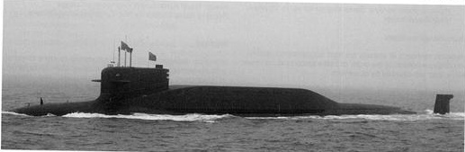

PENNANT LIST-COninued 

<html><body><table border="1"><thead><tr><td>939</td><td>Putuo Shan</td><td>703</td><td>Fenghua</td><td>734</td><td>Rongcheng</td><td>891</td><td></td><td></td><td></td><td></td><td></td><td></td></tr></thead><tbody><tr><td>940</td><td>Tiantai Shan</td><td>704</td><td>Huoqiu</td><td>735</td><td>Huimin</td><td>892 893</td><td>Bi Sheng Hua Luogeng</td><td>792 794 795</td><td>Haiwanxing Tianlangxing</td><td>265 467</td><td></td><td>Dong Biao 265</td></tr><tr><td>980</td><td>Longhu Shan</td><td>705</td><td>Zhangjiagang</td><td>736</td><td>Donggang</td><td></td><td>Zhong Tianyou</td><td></td><td>Tianshuxing</td><td></td><td></td><td>Nan Biao 467</td></tr><tr><td>981</td><td>Dabie Shan</td><td>706</td><td>Jingjiang</td><td>737</td><td>Zhijiang</td><td></td><td></td><td></td><td></td><td></td><td>861</td><td>Changxing Dao</td></tr><tr><td>982</td><td>Taihang Shan</td><td>707</td><td>Kunshan</td><td></td><td></td><td>894</td><td>Ui Siguang</td><td>797</td><td>Tianquanxing</td><td></td><td>862</td><td>Chongming Dao</td></tr><tr><td>985</td><td>Qilian Shan</td><td>710</td><td>Renhuai</td><td>738</td><td>Chibi</td><td>895</td><td>Wu Yunyu</td><td>798</td><td>Yuhengxing</td><td></td><td>863</td><td>Yongxing Dao</td></tr><tr><td>986</td><td>Wanyang Shan</td><td>711</td><td></td><td>739</td><td></td><td></td><td></td><td></td><td>Jinxing</td><td></td><td>864</td><td>Haiyang Dao</td></tr><tr><td>987</td><td>Wuzhi Shan</td><td>712</td><td>Jiangshan Rudong</td><td>741</td><td>Xiaoyi</td><td></td><td></td><td></td><td>799</td><td></td><td>865</td><td>Liugong Dao</td></tr><tr><td>988</td><td>Yimeng Shan</td><td>713</td><td>Zhuji</td><td>742</td><td>Taishan</td><td></td><td>Intelligence vessels</td><td></td><td></td><td></td><td></td><td>Daishan Dao</td></tr><tr><td>989</td><td>Changbai Shan</td><td>714</td><td></td><td>743</td><td>Changshu</td><td></td><td></td><td></td><td></td><td></td><td>866 867</td><td>Daishan Dao</td></tr><tr><td>991</td><td>Emei Shan</td><td>715</td><td>Wenling</td><td>744</td><td>Heshan</td><td></td><td>Bei Ce 901</td><td></td><td>Training ships</td><td></td><td>868</td><td>Donghai Dao</td></tr><tr><td>992</td><td>Huading Shan</td><td>720</td><td>Pingdu</td><td>745</td><td>Luxi</td><td></td><td>Bei Ce 902</td><td>一</td><td></td><td></td><td></td><td>Qinghai Hu</td></tr><tr><td>993</td><td>Luoxiao Shan</td><td>721</td><td>Changyi</td><td>746</td><td>Kaiping</td><td></td><td>Bei Diao 900</td><td></td><td>Jiangmen</td><td></td><td>885 886</td><td>Qiandao Hu</td></tr><tr><td>994</td><td>Daiyun Shan</td><td>722</td><td>Yangshuo</td><td>ex-806</td><td>Zhijiang</td><td></td><td>Bei Diao 990</td><td></td><td>Zhacquing</td><td></td><td>887</td><td>Weishan Hu</td></tr><tr><td>995</td><td>Wanyan Shan</td><td>723</td><td>Yongsheng</td><td>ex-816</td><td>Haimen</td><td></td><td>Bei Diao 991</td><td>81</td><td>Zheng He</td><td></td><td>888 Fuxian Hu</td><td></td></tr><tr><td>996</td><td>Laotie Shan</td><td>724</td><td>Daxin</td><td>ex-839 Liuyang</td><td></td><td></td><td>Beijixing</td><td>82</td><td>Shichang</td><td></td><td>889 Tai Hu</td><td></td></tr><tr><td>997</td><td>Yunwu Shan</td><td>725</td><td>Huarong</td><td></td><td></td><td></td><td>Kalyangxing</td><td>83</td><td>Qi Jiguang</td><td></td><td>890 Chao Hu</td><td></td></tr><tr><td>998</td><td>Kunlun Shan</td><td>726</td><td>Rongjiang</td><td>Principal survey and</td><td></td><td>232</td><td>Tianwangxing</td><td>86</td><td>Polang</td><td>901</td><td>Hulun Hu</td><td></td></tr><tr><td>999</td><td>Jinggang Shan</td><td>727</td><td>Qionghai</td><td>research ships</td><td></td><td></td><td>Dong Ce 232 Dong Ce 233</td><td></td><td></td><td></td><td>902 Dongping Hu</td><td></td></tr><tr><td></td><td></td><td>728</td><td>Hejian</td><td></td><td></td><td>233</td><td>Nan Ce 429</td><td></td><td></td><td></td><td>903 Hoh Xil Hu</td><td></td></tr><tr><td></td><td>Principal mine warfare</td><td>729</td><td>Chishui</td><td></td><td></td><td>429</td><td></td><td></td><td></td><td>904</td><td>Gaoyao Hu</td><td></td></tr><tr><td>forces</td><td></td><td>730</td><td>Qingzhou</td><td>872</td><td>Zhu Khezen</td><td>430</td><td>Nan Ce 430</td><td></td><td>Principal auxiliaries</td><td>905</td><td>Chagan Hu</td><td></td></tr><tr><td></td><td></td><td>731</td><td>Yucheng</td><td>873</td><td>Qian Xuesen</td><td>780</td><td></td><td></td><td></td><td>906</td><td>Hong Hu</td><td></td></tr><tr><td>701</td><td>Xiangshan</td><td>732</td><td>Wudi</td><td>874</td><td>Deng Jiaxian</td><td>781</td><td></td><td></td><td>Hong Hu</td><td>907</td><td>Luoma Hu</td><td></td></tr><tr><td>702</td><td>Chongming</td><td></td><td></td><td>875</td><td>Qian Sanqiang</td><td>782</td><td></td><td></td><td></td><td></td><td></td><td></td></tr><tr><td></td><td></td><td>733</td><td>Xuanwei</td><td>876</td><td>Qian Weichang</td><td>783</td><td></td><td>88 89</td><td>Xu Xiake</td><td>961 962</td><td>Lugu Hu Junshan Hu</td><td></td></tr></tbody></table></body></html>

## SUBMARINES 

## Strategic missile submarines 

Notes:(1)Following the Type 094(Jin)programme,it is expected that a new Type 096 submarine, which is under developmentwill enter service in the 202Os. While design details remain sketchyit is anticipated that the submaines 

<html><body><table border="1"><tr><td>Name CHANGZHENG 09</td><td>No</td></tr><tr><td></td><td>409</td></tr><tr><td>CHANGZHENG 10</td><td>412</td></tr><tr><td>CHANGZHENG 11 CHANGZHENG12</td><td>413</td></tr><tr><td>CHANGZHENG 17</td><td>414</td></tr><tr><td>CHANGZHENG 18</td><td>420</td></tr><tr><td></td><td>421</td></tr></table></body></html>

Displacement,tonnes:8.000 surfaced:10.000 dived Dimensions.metres (feet）:137.0x11.8x8.3（449.5×38.7×27.2)

Complement: 140

Machinery: Nuclear;2 PWR;15O MW:2turbines;1 shaft Missiles:SLBM:12JL-2(CSS-N-14):3-stagesolid-fuel rocket;inertil gudance witstellrandsatllite rernce updates to 7.200+ km (3.995+nmiles) single nuclear warhead of 1 MT or 3-4 MIRV of smaller selectable yld.CEP 300m approximately 

Torpedoes:6-533mm tubes;combination of Yu-3ll; active passive homing to 13 km (7n miles)at 35 kt;electic;warhead 205 kg: depth to 350 m and Yu-4B; wire-guided and active/passive homing to15km(8.1nmiles)at 40k;electric; warhead 309 kg.

Physical countermeasures: Decoys: To be announced.Electronic countermeasures:ESM: To be announced.Radars:Surface search/navigation:Type 359;-band.Sonars: Hull mounted passive/active；flank arrays.Passive intercept array.Towed array.

Programmes: Nucloar-powered ballistic missile submarines.The first of class became operational as a submarine in mid-2007 and as an SSBN in 2014,based on repors that theJL-2missile had entered operational service.There was a gap of several years botween the launch of the fourth boat and the final pairwhich were noted to be undegoing JIN CLASS 

may carry the larger JL-3 missile,thought to be a derivative of the DF-41 ICBM,which has an estimated range of 12-15.00o km. Construction expected to take place at Bohai.

4/2019,Mark Schlofelbein/AFP via Getty Images/1768014

## JIN CLASS 

outfitting alongside from 2017 and 2018 respectivelyThe OGH221.sixth was commissioned in April 2021.

Structure: Likely to have significant commonality with the Type 093 (Shang-class) SSN,with the addition of a missile compartment midships, behind the fin. The raised casing structure encompasses the ballistic misille tubes.Hydrodynamic improvements appear to have been introduced progressively,including a more rounded shape to the forward part of the fin noted on one boat in 2016.(2) PLAN nuclear submarines are roferred to as Changzheng (Long March) plus a number, as well as a pennant.Names and numbers may be assigned to new units after decommissioning.

6JIN(TYPE094)CLASS(SSBN)

<html><body><table border="1"><thead><tr><td>Builders</td><td>Laid down</td><td>Launched</td><td>Commissioned</td></tr></thead><tbody><tr><td>Bohai Shipyard, Huludao</td><td>2001</td><td>28 Jul 2004</td><td>Mar 2007</td></tr><tr><td>Bohai Shipyard, Huludao</td><td>2003</td><td>2006</td><td>2010</td></tr><tr><td>Bohai Shipyard, Huludao</td><td>2004</td><td>Dec 2009</td><td>2012</td></tr><tr><td>Bohai Shipyard, Huludao</td><td>2006</td><td>2011</td><td>2015</td></tr><tr><td>Bohai Shipyard, Huludao Bohai Shipyard, Huludao</td><td></td><td>2017</td><td>Apr 2020</td></tr><tr><td></td><td></td><td></td><td>23 Apr 2021</td></tr></tbody></table></body></html>

and reduction of the number of openings in the casing on one boat,which participatedin the April 2019 Fleet Review.Several boats have a tube above the upper rudder,which suggests they are equipped with a reelable towed aray.Modifications on final pair reported to include updates to sonars, radar,and torpedo armament.

Operational:Theboats are basedat Yulin-Yalongwan on Hainan.Thefirstoperationaldeterrentpatrolmay avebeen conducted in 2016 but has not been confirmed.

6/2019,Shipsof thoWorld/1748542

